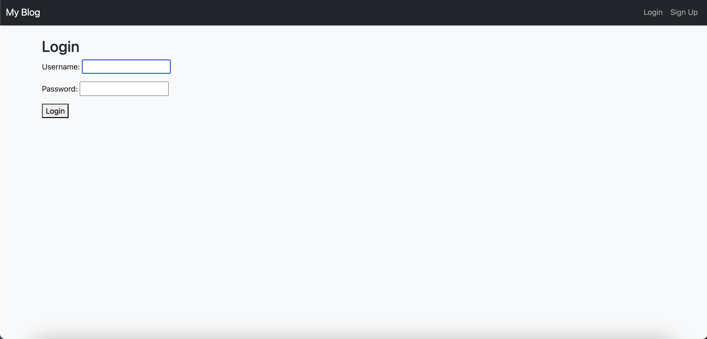

# 📝 Blog App – Django + MySQL

A minimal blog web application built using Django and MySQL. Users can create, edit, view, and delete blog posts. Authentication is required for creating and managing posts.

---

## 📌 Features

- 📃 List, create, update, delete blog posts
- 🔐 User authentication (Login / Logout)
- 👤 Author-specific controls (only authors can edit/delete their posts)
- 🧾 Class-based views (CBVs) for clean architecture
- 🎨 Clean and modern UI with Bootstrap 5
- 🗃️ MySQL integration as backend database

---

## 📂 Project Structure

```bash
Blog-API-Django/
├── blog/ # Blog app with models, views, urls, templates
├── blog_project/ # Django project settings and routing
├── templates/ # Global templates directory
│ └── blog/ # App-specific templates
│ ├── base.html
│ ├── post_list.html
│ ├── post_detail.html
│ ├── post_form.html
│ └── post_confirm_delete.html
├── static/
│ └── css/
│ └── style.css
├── manage.py
└── requirements.txt
```

---


## 🚀 Getting Started

### 1. Clone the repository

```bash
git clone https://github.com/your-username/your-repo-name.git
cd Blog-API-Django
```

### 2. Create and activate a virtual environment
```bash
python3 -m venv venv
source venv/bin/activate
```

### 3. Install dependencies
```bash
pip install -r requirements.txt
```
Or install manually:
```bash
pip install django mysqlclient djangorestframework
```

### 4. Configure database
Ensure your MySQL server is running and update the following in blog_project/settings.py:
```bash
DATABASES = {
    'default': {
        'ENGINE': 'django.db.backends.mysql',
        'NAME': 'your_name',
        'USER': 'your_username',
        'PASSWORD': 'your_password',
        'HOST': 'localhost',
        'PORT': '3306',
    }
}
```

### 5. Run migrations
```bash
python manage.py makemigrations
python manage.py migrate
```

### 6. Create superuser
```bash
python manage.py createsuperuser
```

### 7. Run the development server
```bash
python manage.py runserver
```

## Login Credentials (for testing)
Use the superuser credentials you created to access the admin panel and manage users/posts.

## 📄 Usage

- `/` — Homepage with list of all posts  
- `/post/<id>/` — View a full post  
- `/post/new/` — Create a post (login required)  
- `/post/<id>/edit/` — Edit your post  
- `/post/<id>/delete/` — Confirm delete  

---

## 🔐 Authentication

- Users can log in/out from the navbar  
- Only logged-in users can create/edit/delete posts  
- Only post authors can edit or delete their own posts  

---

## 🎨 UI and Styling

- Bootstrap 5.3 used via CDN for modern, responsive layout  
- Custom styles in `static/css/style.css`  

---

## 📷 Screenshots

### 🏠 Homepage


### 📝 View Post


### ➕ Create Post


### 🔐 Login Page


---

## 🛠️ Tech Stack

- **Backend**: Django 5.2  
- **Frontend**: HTML5, Bootstrap 5  
- **Database**: MySQL 8.x  
- **Python**: 3.12  
- **Others**: Django REST Framework

---

## 🙋‍♀️ Author

**Divya B Gowda**  
💻 Python Backend Developer | Aspiring Data Scientist  
📬 [Connect on LinkedIn](https://www.linkedin.com/in/divya2004/)  
📂 [GitHub Profile](https://github.com/DivyaBGowda484)
